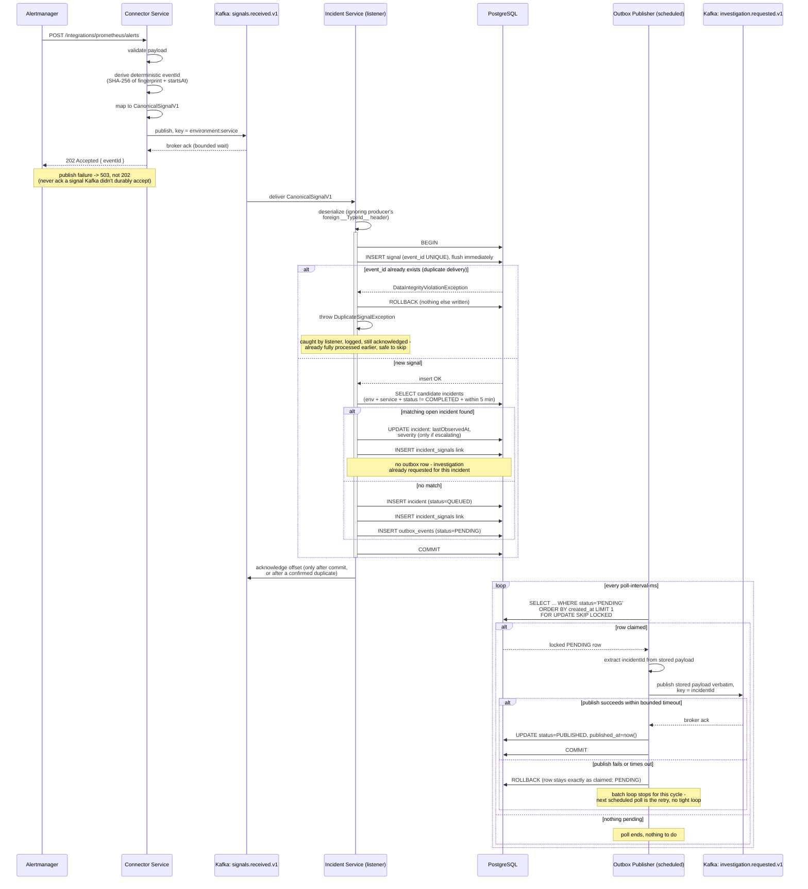

# Phase 1 Reactive Flow — Sequence Diagram

Complete request lifecycle for the reactive golden path, as implemented and
validated in Milestones A–F. Covers the happy path, the idempotent-duplicate
branch, the correlation-vs-new-incident branch, and the outbox retry loop.

## Notes on what this diagram intentionally omits

- **Investigation Service** does not exist yet (out of scope through Milestone F) — `investigation.requested.v1` has no consumer in this diagram.
- **The crash-between-Kafka-ack-and-status-update window** on the Outbox Publisher side is real and accepted, not shown as a failure branch here — see "Crash Window Documentation" in `docs/architecture/phase-1-validation-report.md` for why.
- **Kafka partition assignment / consumer group rebalance** (e.g. after a broker restart) isn't modeled — it's infrastructure-level Kafka behavior, not application logic, though Milestone F's validation did observe and confirm it doesn't lose messages.
